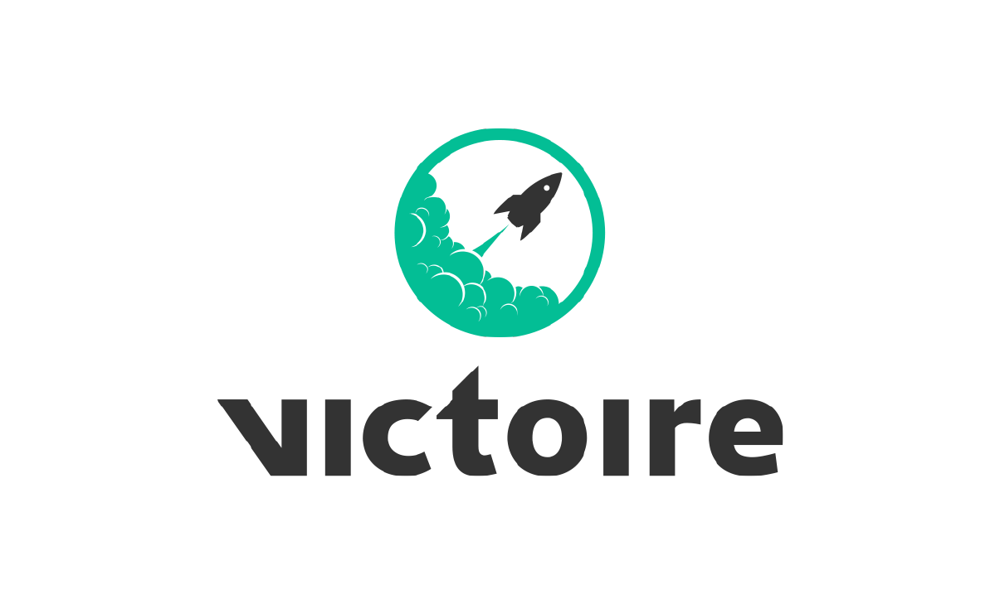

##Overview

Victoire is a **Symfony2** overlay integrating a business aware cms and a large panel of web marketing tools.
It can be setup in any symfony2 project in just some few minutes.

The main goal is to give to the final customer the ability to **create**/**edit**/**delete** each content on its website, even for a static content than a business entity based content and **whitout any development skill** and with the minimum of training.

##Contribution

Victoire is an open-source, community driven project.
We are keen on getting your participation for the development of this product.
To do so, please follow the steps [**here**](https://github.com/Victoire/victoire/blob/master/CONTRIBUTION.md)

You can see the list of [contributors](https://github.com/Victoire/Victoire/contributors)

##Install Victoire

To do so, follow the [setup guide](http://github.com/victoire/victoire/blob/master/setup.md)

##What's inside?

Component | Description
------------ | -------------
[**AnalyticsBundle**][5] | This bundle record the user's navigation history
[**BlogBundle**][2] | Allow to create and manage one or several blog
[**BusinessEntityBundle**][3] | Manage BusinessEntity
[**BusinessEntityPageBundle**][4] | Define and manage [BusinessEntityPage][18] and [BusinessEntityPagePattern][19]
[**CoreBundle**][1] | The core
[**FilterBundle**][23] | Allows to filter any list's results
[**FormBundle**][6] | Based on MopaBootstrapBundle, it brings some cool form themes
[**I18nBundle**][17] | This bundle manage the internationalization system
[**MediaBundle**][7] | Based on [KunstmaanMediaBundle][21], it offers a file management interface and a bridge to the widgets
[**PageBundle**][8] | One of the most important bundles, it contains all the base page logic
[**QueryBundle**][9] | Give the possibility to non technical user to build a query
[**RessourcesBundle**][24] | Contains JS libraries
[**SeoBundle**][10] | This bundle brings to user about than 50 SEO points
[**SitemapBundle**][20] | Sitemap related logic
[**TemplateBundle**][11] | Contains the pages templates logic (nearly close to [PageBundle][22])
[**TwigBundle**][13] | Brings ErrorPage (404, 500, 503 etc) and responsive support
[**UserBundle**][14] | Extends [FosUserBundle][12], this bundle brings a ready to use system you can override
[**WidgetBundle**][15] | Contains all the base widget logic to be able to use Widgets
[**WidgetMapBundle**][16] | Each view has a widget map, this bundle contains all the widget maps logic

##Bug tracking

Victoire uses GitHub issues. If you have found a bug, please create an issue.

##MIT License

License can be found [here](http://github.com/victoire/victoire/blob/master/license.md).

[1]:  http://github.com/victoire/victoire/blob/master/Bundle/CoreBundle/README.md
[2]:  http://github.com/victoire/victoire/blob/master/Bundle/BlogBundle/README.md
[3]:  http://github.com/victoire/victoire/blob/master/Bundle/BusinessEntityBundle/README.md
[4]:  http://github.com/victoire/victoire/blob/master/Bundle/BusinessEntityPageBundle/README.md
[5]:  http://github.com/victoire/victoire/blob/master/Bundle/AnalyticsBundle/README.md
[6]:  http://github.com/victoire/victoire/blob/master/Bundle/FormBundle/README.md
[7]:  http://github.com/victoire/victoire/blob/master/Bundle/MediaBundle/README.md
[8]:  http://github.com/victoire/victoire/blob/master/Bundle/PageBundle/README.md
[9]:  http://github.com/victoire/victoire/blob/master/Bundle/QueryBundle/README.md
[10]: http://github.com/victoire/victoire/blob/master/Bundle/SeoBundle/README.md
[11]: http://github.com/victoire/victoire/blob/master/Bundle/TemplateBundle/README.md
[12]: http://github.com/FriendsOfSymfony/FOSUserBundle
[13]: http://github.com/victoire/victoire/blob/master/Bundle/TwigBundle/README.md
[14]: http://github.com/victoire/victoire/blob/master/Bundle/UserBundle/README.md
[15]: http://github.com/victoire/victoire/blob/master/Bundle/WidgetBundle/README.md
[16]: http://github.com/victoire/victoire/blob/master/Bundle/WidgetMapBundle/README.md
[17]: http://github.com/victoire/victoire/blob/master/Bundle/I18nBundle/README.md
[18]: http://github.com/victoire/victoire/blob/master/Bundle/BusinessEntityPageBundle/Resources/doc/BusinessEntityPage.md
[19]: http://github.com/victoire/victoire/blob/master/Bundle/BusinessEntityPageBundle/Resources/doc/BusinessEntityPagePattern.md
[20]: http://github.com/victoire/victoire/blob/master/Bundle/SitemapBundle/README.md
[21]: http://github.com/Kunstmaan/KunstmaanMediaBundle
[22]: http://github.com/victoire/victoire/blob/master/Bundle/PageBundle
[23]: http://github.com/victoire/victoire/blob/master/Bundle/FilterBundle/README.md
[24]: http://github.com/victoire/victoire/blob/master/Bundle/RessourcesBundle/README.md
